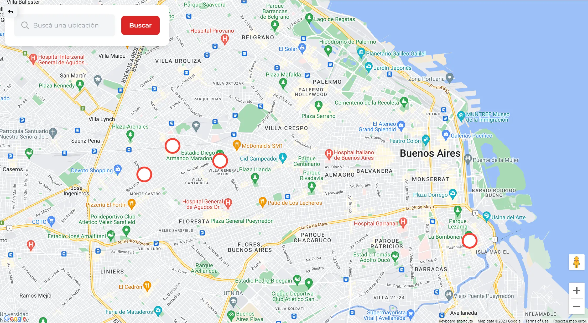

## What is PointWall?

PointWall is a platform for urban art enthusiasts, artists, and the general public. It features a map-based interface that allows users to explore and discover street art in their city or anywhere else in the world.

## How it started

During my final year of high school, a group of students one year behind me started the project as a way to showcase street art in our city. Initially, it consisted of a public Google Maps collection of street art locations embedded in a static HTML page.

As new ideas emerged, the project began to grow in scope and complexity.

I joined the project as a developer and designer, contributing to the web application and helping shape its direction. Two friends from my class also joined the team, focusing primarily on the backend.

## What we did

I redesigned the user interface from scratch and helped transform the original static HTML page into a fully functional web application built with Next.js and Tailwind CSS.

Together with one of my friends, I also implemented the map interface using `google-map-react` and googlep-maps-react-markers.

The backend was primarily developed by my two friends. We used CockroachDB as the database, Prisma as the ORM, and Next.js API routes to implement the application’s server-side functionality.

We also added user authentication with NextAuth.js and built an administration panel for reviewing and approving submitted content.
